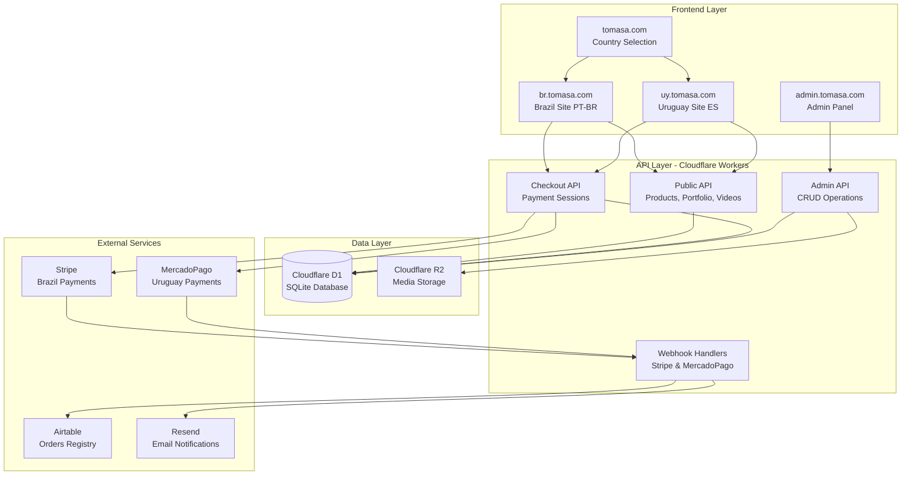
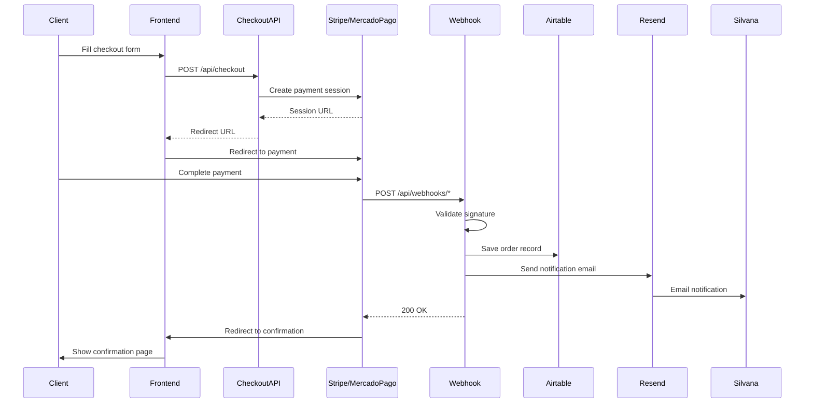

# Design Document: TOMASA E-commerce Platform

## Overview

TOMASA é uma plataforma de e-commerce multi-regional especializada em moda agro, operando no Brasil (PT-BR) e Uruguai (ES). A arquitetura é baseada inteiramente em Cloudflare (Pages, Workers, D1, R2), com integração de pagamentos regionalizados (Stripe para Brasil, MercadoPago para Uruguai), sistema de notificações via Resend, e registro de vendas no Airtable para gestão de envios.

O sistema é estruturado como um monorepo contendo: apps/web (frontend público multi-regional), apps/admin (painel administrativo), e workers (backend API). A plataforma suporta catálogo de produtos, portfólio de peças entregues, vídeos promocionais, checkout regionalizado, e gestão completa via painel administrativo.

## Architecture



## Main Workflow - Sales Flow



## Components and Interfaces

### Frontend Components (apps/web)

**Technology Stack**: Next.js 14 (App Router), Tailwind CSS, Framer Motion, next-intl, Cloudflare Pages

#### Component 1: Country Selector (/)

**Purpose**: Initial landing page for country/region selection

**Interface**:
```typescript
interface CountrySelectorProps {
  onSelectCountry: (country: 'BR' | 'UY') => void
}


interface CountryConfig {
  code: 'BR' | 'UY'
  name: string
  subdomain: string
  locale: 'pt-BR' | 'es'
  currency: 'BRL' | 'UYU'
  paymentProvider: 'stripe' | 'mercadopago'
}
```

**Responsibilities**:
- Display fullscreen logo and country selection buttons
- Set tomasa_region cookie on selection
- Redirect to appropriate subdomain (br.tomasa.com or uy.tomasa.com)

#### Component 2: Product Catalog (/catalogo)

**Purpose**: Display product grid with filtering capabilities

**Interface**:
```typescript
interface ProductCatalogProps {
  region: 'BR' | 'UY'
  initialProducts: Product[]
}

interface Product {
  id: string
  name: string
  slug: string
  description: string
  price_brl: number | null
  price_uyu: number | null
  category: string
  sizes: string[]
  images: string[]
  featured: boolean
  active: boolean
  created_at: string
}
```

**Responsibilities**:
- Fetch and display products from API
- Filter by category
- Responsive grid (2 columns mobile, 4 columns desktop)
- Navigate to product detail page

#### Component 3: Product Detail (/catalogo/[slug])

**Purpose**: Display detailed product information with purchase option


**Interface**:
```typescript
interface ProductDetailProps {
  product: Product
  region: 'BR' | 'UY'
}

interface ProductGallery {
  images: string[]
  currentIndex: number
  onNavigate: (index: number) => void
}
```

**Responsibilities**:
- Display image gallery with navigation
- Show product description and available sizes
- Display price in regional currency
- Provide "Buy" button leading to checkout

#### Component 4: Checkout Form (/checkout)

**Purpose**: Collect customer information and process payment

**Interface**:
```typescript
interface CheckoutFormProps {
  product: Product
  selectedSize: string
  region: 'BR' | 'UY'
}

interface CheckoutFormData {
  name: string
  email: string
  whatsapp: string
  address: string
  postalCode: string
  product: string
  size: string
}
```

**Responsibilities**:
- Validate form inputs
- Submit to /api/checkout
- Redirect to Stripe or MercadoPago based on region
- Display confirmation page after successful payment

#### Component 5: Portfolio Gallery (/portfolio)

**Purpose**: Display masonry gallery of delivered pieces

**Interface**:
```typescript
interface PortfolioGalleryProps {
  items: PortfolioItem[]
}

interface PortfolioItem {
  id: string
  title: string
  category: string
  image_url: string
  delivered_at: string
  created_at: string
}
```


**Responsibilities**:
- Fetch portfolio items from API
- Display masonry grid layout
- No pricing or purchase options (showcase only)

### Backend Components (Cloudflare Workers)

#### Component 6: Products API

**Purpose**: Manage product data retrieval

**Interface**:
```typescript
interface ProductsAPI {
  listProducts(filters?: ProductFilters): Promise<Product[]>
  getProductBySlug(slug: string): Promise<Product | null>
}

interface ProductFilters {
  category?: string
  featured?: boolean
  active?: boolean
}
```

**Responsibilities**:
- Query D1 database for products
- Filter by category, featured status, active status
- Return products with regional pricing

#### Component 7: Checkout API

**Purpose**: Create payment sessions with regional providers

**Interface**:
```typescript
interface CheckoutAPI {
  createSession(data: CheckoutRequest): Promise<CheckoutResponse>
}

interface CheckoutRequest {
  region: 'BR' | 'UY'
  customer: CustomerData
  product: ProductData
  size: string
}

interface CustomerData {
  name: string
  email: string
  whatsapp: string
  address: string
  postalCode: string
}

interface ProductData {
  id: string
  name: string
  price: number
}

interface CheckoutResponse {
  success: boolean
  sessionUrl?: string
  error?: string
}
```


**Responsibilities**:
- Validate checkout data
- Create Stripe session (BR) or MercadoPago session (UY)
- Return payment URL for redirect

#### Component 8: Webhook Handler

**Purpose**: Process payment confirmations and trigger post-payment actions

**Interface**:
```typescript
interface WebhookHandler {
  handleStripeWebhook(request: Request): Promise<Response>
  handleMercadoPagoWebhook(request: Request): Promise<Response>
}

interface WebhookPayload {
  paymentId: string
  status: string
  amount: number
  currency: string
  customerEmail: string
  metadata: Record<string, any>
}
```

**Responsibilities**:
- Validate webhook signatures
- Extract payment and customer data
- Save order to Airtable
- Send notification email via Resend
- Return 200 OK to payment provider

#### Component 9: Admin API

**Purpose**: CRUD operations for products, portfolio, and videos

**Interface**:
```typescript
interface AdminAPI {
  // Products
  createProduct(data: ProductInput): Promise<Product>
  updateProduct(id: string, data: Partial<ProductInput>): Promise<Product>
  deleteProduct(id: string): Promise<void>
  
  // Portfolio
  createPortfolioItem(data: PortfolioInput): Promise<PortfolioItem>
  updatePortfolioItem(id: string, data: Partial<PortfolioInput>): Promise<PortfolioItem>
  deletePortfolioItem(id: string): Promise<void>
  
  // Videos
  createVideo(data: VideoInput): Promise<Video>
  updateVideo(id: string, data: Partial<VideoInput>): Promise<Video>
  deleteVideo(id: string): Promise<void>
  
  // Upload
  uploadImage(file: File, type: 'product' | 'portfolio', id: string): Promise<string>
}
```


**Responsibilities**:
- Authenticate admin requests
- Perform CRUD operations on D1 database
- Handle image uploads to R2
- Return appropriate responses

### Admin Panel Components (apps/admin)

**Technology Stack**: Next.js 14, NextAuth.js, Tailwind CSS, Shadcn/ui, Cloudflare Pages

#### Component 10: Admin Dashboard

**Purpose**: Overview of recent sales and quick navigation

**Interface**:
```typescript
interface AdminDashboardProps {
  recentOrders: OrderSummary[]
}

interface OrderSummary {
  id: string
  customerName: string
  product: string
  amount: number
  region: 'BR' | 'UY'
  status: string
  date: string
}
```

**Responsibilities**:
- Display recent orders from Airtable
- Provide navigation to product, portfolio, and video management
- Show key metrics (total sales, pending shipments)

#### Component 11: Product Management

**Purpose**: CRUD interface for products with image upload

**Interface**:
```typescript
interface ProductManagementProps {
  products: Product[]
}

interface ProductForm {
  name: string
  slug: string
  description: string
  price_brl: number
  price_uyu: number
  category: string
  sizes: string[]
  images: File[]
  featured: boolean
  active: boolean
}
```

**Responsibilities**:
- List all products with edit/delete actions
- Form for creating/editing products
- Image upload to R2 via Admin API
- Slug generation and validation


## Data Models

### Database Schema (Cloudflare D1)

#### Model 1: Product

```sql
CREATE TABLE products (
  id TEXT PRIMARY KEY,
  name TEXT NOT NULL,
  slug TEXT UNIQUE NOT NULL,
  description TEXT,
  price_brl REAL,
  price_uyu REAL,
  category TEXT,
  sizes TEXT,           -- JSON array ex: ["P","M","G"]
  images TEXT,          -- JSON array of R2 URLs
  featured INTEGER DEFAULT 0,
  active INTEGER DEFAULT 1,
  created_at TEXT DEFAULT (datetime('now'))
);
```

**TypeScript Interface**:
```typescript
interface Product {
  id: string
  name: string
  slug: string
  description: string | null
  price_brl: number | null
  price_uyu: number | null
  category: string | null
  sizes: string[]
  images: string[]
  featured: boolean
  active: boolean
  created_at: string
}
```

**Validation Rules**:
- id: UUID v4 format
- name: Non-empty string, max 200 characters
- slug: Lowercase, alphanumeric with hyphens, unique
- price_brl: Positive number or null
- price_uyu: Positive number or null
- sizes: Valid JSON array of strings
- images: Valid JSON array of R2 URLs
- featured: 0 or 1 (boolean)
- active: 0 or 1 (boolean)

#### Model 2: Portfolio

```sql
CREATE TABLE portfolio (
  id TEXT PRIMARY KEY,
  title TEXT,
  category TEXT,
  image_url TEXT,       -- R2 URL
  delivered_at TEXT,
  created_at TEXT DEFAULT (datetime('now'))
);
```


**TypeScript Interface**:
```typescript
interface PortfolioItem {
  id: string
  title: string | null
  category: string | null
  image_url: string | null
  delivered_at: string | null
  created_at: string
}
```

**Validation Rules**:
- id: UUID v4 format
- title: Max 200 characters
- category: Max 100 characters
- image_url: Valid R2 URL format
- delivered_at: ISO 8601 date string

#### Model 3: Video

```sql
CREATE TABLE videos (
  id TEXT PRIMARY KEY,
  title TEXT,
  youtube_url TEXT NOT NULL,
  display_order INTEGER DEFAULT 0
);
```

**TypeScript Interface**:
```typescript
interface Video {
  id: string
  title: string | null
  youtube_url: string
  display_order: number
}
```

**Validation Rules**:
- id: UUID v4 format
- title: Max 200 characters
- youtube_url: Valid YouTube URL format
- display_order: Non-negative integer

### External Data Models

#### Model 4: Airtable Order

**Purpose**: Store order information for shipping management

**Fields**:
```typescript
interface AirtableOrder {
  Nome: string
  Email: string
  WhatsApp: string
  Endereço: string
  'CEP / CP': string
  Produto: string
  Tamanho: string
  Valor: number
  País: 'Brasil' | 'Uruguai'
  Pagamento: 'Stripe' | 'MercadoPago'
  Status: 'Aguardando envio' | 'Enviado' | 'Entregue'
  Data: string
  'ID Pagamento': string
}
```


**Validation Rules**:
- Nome: Non-empty string
- Email: Valid email format
- WhatsApp: Valid phone format with country code
- Endereço: Non-empty string
- CEP / CP: Valid postal code format
- Produto: Non-empty string
- Tamanho: Non-empty string
- Valor: Positive number
- País: Must be 'Brasil' or 'Uruguai'
- Pagamento: Must be 'Stripe' or 'MercadoPago'
- Status: Must be one of the three defined values
- Data: ISO 8601 date string
- ID Pagamento: Non-empty string from payment provider

### Storage Structure (Cloudflare R2)

```
tomasa-media/
├── products/
│   └── [product-id]/
│       ├── foto-1.webp
│       ├── foto-2.webp
│       └── foto-n.webp
└── portfolio/
    └── [portfolio-id]/
        └── foto.webp
```

**Naming Convention**:
- Bucket name: `tomasa-media`
- Product images: `products/{product-id}/foto-{index}.webp`
- Portfolio images: `portfolio/{portfolio-id}/foto.webp`
- Format: WebP for optimal compression
- Public URL: `https://media.tomasa.com/{path}`

## Algorithmic Pseudocode

### Main Processing Algorithm: Checkout Flow

```pascal
ALGORITHM processCheckout(checkoutData)
INPUT: checkoutData of type CheckoutRequest
OUTPUT: result of type CheckoutResponse

BEGIN
  ASSERT validateCheckoutData(checkoutData) = true
  
  // Step 1: Determine payment provider based on region
  provider ← getPaymentProvider(checkoutData.region)
  
  // Step 2: Fetch product details from database
  product ← database.getProduct(checkoutData.product.id)
  ASSERT product ≠ null AND product.active = true
  
  // Step 3: Calculate amount based on region
  amount ← calculateAmount(product, checkoutData.region)
  ASSERT amount > 0

  
  // Step 4: Create payment session with provider
  IF provider = "stripe" THEN
    session ← createStripeSession(checkoutData, amount)
  ELSE IF provider = "mercadopago" THEN
    session ← createMercadoPagoSession(checkoutData, amount)
  ELSE
    RETURN {success: false, error: "Invalid payment provider"}
  END IF
  
  ASSERT session ≠ null AND session.url ≠ null
  
  // Step 5: Return session URL for redirect
  RETURN {success: true, sessionUrl: session.url}
END
```

**Preconditions**:
- checkoutData is validated and well-formed
- checkoutData.region is either 'BR' or 'UY'
- checkoutData.product.id exists in database
- Product is active and has valid pricing for region

**Postconditions**:
- Returns CheckoutResponse with success status
- If successful: sessionUrl contains valid payment URL
- If error: error message describes the failure
- No side effects on database (read-only operation)

**Loop Invariants**: N/A (no loops in main flow)

### Webhook Processing Algorithm

```pascal
ALGORITHM processWebhook(webhookRequest, provider)
INPUT: webhookRequest of type Request, provider of type string
OUTPUT: response of type Response

BEGIN
  // Step 1: Validate webhook signature
  isValid ← validateWebhookSignature(webhookRequest, provider)
  IF NOT isValid THEN
    RETURN Response(401, "Invalid signature")
  END IF
  
  // Step 2: Parse webhook payload
  payload ← parseWebhookPayload(webhookRequest.body, provider)
  ASSERT payload ≠ null
  
  // Step 3: Check payment status
  IF payload.status ≠ "succeeded" AND payload.status ≠ "approved" THEN
    RETURN Response(200, "Payment not completed")
  END IF
  
  // Step 4: Extract order data from metadata
  orderData ← extractOrderData(payload.metadata)
  ASSERT orderData.isComplete() = true

  
  // Step 5: Save order to Airtable
  airtableRecord ← {
    Nome: orderData.customerName,
    Email: orderData.customerEmail,
    WhatsApp: orderData.whatsapp,
    Endereço: orderData.address,
    "CEP / CP": orderData.postalCode,
    Produto: orderData.productName,
    Tamanho: orderData.size,
    Valor: payload.amount,
    País: IF provider = "stripe" THEN "Brasil" ELSE "Uruguai",
    Pagamento: IF provider = "stripe" THEN "Stripe" ELSE "MercadoPago",
    Status: "Aguardando envio",
    Data: currentDateTime(),
    "ID Pagamento": payload.paymentId
  }
  
  airtableResult ← airtable.createRecord(airtableRecord)
  ASSERT airtableResult.success = true
  
  // Step 6: Send email notification
  emailData ← {
    to: RESEND_TO,
    from: RESEND_FROM,
    subject: "Nova venda - " + orderData.productName,
    html: formatOrderEmail(orderData, payload)
  }
  
  emailResult ← resend.sendEmail(emailData)
  ASSERT emailResult.success = true
  
  // Step 7: Return success response
  RETURN Response(200, "Webhook processed successfully")
END
```

**Preconditions**:
- webhookRequest contains valid HTTP request with body
- provider is either "stripe" or "mercadopago"
- Webhook signature secret is configured in environment
- Airtable and Resend credentials are valid

**Postconditions**:
- Returns HTTP 200 if webhook processed successfully
- Returns HTTP 401 if signature validation fails
- Order record created in Airtable if payment succeeded
- Email notification sent to Silvana if payment succeeded
- Idempotent: duplicate webhooks don't create duplicate records

**Loop Invariants**: N/A (no loops in main flow)

### Product Listing Algorithm

```pascal
ALGORITHM listProducts(filters)
INPUT: filters of type ProductFilters
OUTPUT: products of type Product[]

BEGIN
  // Step 1: Build SQL query with filters
  query ← "SELECT * FROM products WHERE active = 1"
  params ← []

  
  IF filters.category ≠ null THEN
    query ← query + " AND category = ?"
    params.add(filters.category)
  END IF
  
  IF filters.featured = true THEN
    query ← query + " AND featured = 1"
  END IF
  
  query ← query + " ORDER BY created_at DESC"
  
  // Step 2: Execute query
  results ← database.execute(query, params)
  
  // Step 3: Parse JSON fields for each product
  products ← []
  FOR each row IN results DO
    ASSERT row.sizes IS valid JSON
    ASSERT row.images IS valid JSON
    
    product ← {
      id: row.id,
      name: row.name,
      slug: row.slug,
      description: row.description,
      price_brl: row.price_brl,
      price_uyu: row.price_uyu,
      category: row.category,
      sizes: JSON.parse(row.sizes),
      images: JSON.parse(row.images),
      featured: row.featured = 1,
      active: row.active = 1,
      created_at: row.created_at
    }
    
    products.add(product)
  END FOR
  
  RETURN products
END
```

**Preconditions**:
- filters is a valid ProductFilters object (may be empty)
- Database connection is established
- products table exists and has correct schema

**Postconditions**:
- Returns array of Product objects
- All returned products have active = true
- Products are ordered by created_at descending
- JSON fields (sizes, images) are properly parsed
- Empty array returned if no products match filters

**Loop Invariants**:
- All previously processed products have valid parsed JSON fields
- products array contains only valid Product objects
- No duplicate products in results array

## Key Functions with Formal Specifications

### Function 1: validateCheckoutData()

```typescript
function validateCheckoutData(data: CheckoutRequest): boolean
```


**Preconditions**:
- data parameter is defined (not null/undefined)

**Postconditions**:
- Returns true if and only if all validation checks pass
- Returns false if any validation fails
- No mutations to data parameter
- No side effects

**Validation Logic**:
- data.region must be 'BR' or 'UY'
- data.customer.name must be non-empty string
- data.customer.email must match email regex pattern
- data.customer.whatsapp must match phone regex pattern
- data.customer.address must be non-empty string
- data.customer.postalCode must be non-empty string
- data.product.id must be valid UUID format
- data.product.name must be non-empty string
- data.product.price must be positive number
- data.size must be non-empty string

### Function 2: createStripeSession()

```typescript
function createStripeSession(
  checkoutData: CheckoutRequest, 
  amount: number
): Promise<StripeSession>
```

**Preconditions**:
- checkoutData is validated (validateCheckoutData returns true)
- amount is positive number
- STRIPE_SECRET_KEY is configured in environment
- Stripe API is accessible

**Postconditions**:
- Returns StripeSession object with valid session URL
- Session includes customer email and metadata
- Session amount matches input amount
- Session currency is 'brl'
- Session success_url and cancel_url are configured
- No database modifications

**Side Effects**:
- Creates session in Stripe's system
- Session expires after 24 hours if not completed

### Function 3: createMercadoPagoSession()

```typescript
function createMercadoPagoSession(
  checkoutData: CheckoutRequest, 
  amount: number
): Promise<MercadoPagoSession>
```

**Preconditions**:
- checkoutData is validated (validateCheckoutData returns true)
- amount is positive number
- MERCADOPAGO_ACCESS_TOKEN is configured in environment
- MercadoPago API is accessible


**Postconditions**:
- Returns MercadoPagoSession object with valid init_point URL
- Preference includes payer email and metadata
- Preference amount matches input amount
- Preference currency is 'UYU'
- Preference back_urls are configured
- No database modifications

**Side Effects**:
- Creates preference in MercadoPago's system
- Preference expires after 30 days if not completed

### Function 4: validateWebhookSignature()

```typescript
function validateWebhookSignature(
  request: Request, 
  provider: 'stripe' | 'mercadopago'
): boolean
```

**Preconditions**:
- request contains headers and body
- provider is either 'stripe' or 'mercadopago'
- Webhook secret is configured for the provider

**Postconditions**:
- Returns true if signature is valid
- Returns false if signature is invalid or missing
- No mutations to request
- No side effects

**Validation Logic**:
- For Stripe: Verify stripe-signature header using STRIPE_WEBHOOK_SECRET
- For MercadoPago: Verify x-signature header using MERCADOPAGO_WEBHOOK_SECRET
- Use constant-time comparison to prevent timing attacks

### Function 5: uploadImageToR2()

```typescript
function uploadImageToR2(
  file: File, 
  type: 'product' | 'portfolio', 
  id: string
): Promise<string>
```

**Preconditions**:
- file is valid File object
- file.type is 'image/webp' or convertible image format
- type is either 'product' or 'portfolio'
- id is valid UUID format
- R2 bucket credentials are configured
- R2 bucket exists

**Postconditions**:
- Returns public URL of uploaded image
- Image is stored in R2 at correct path
- Image is publicly accessible via CDN
- Original file is not modified
- If upload fails, throws error with descriptive message


**Side Effects**:
- Creates or overwrites file in R2 bucket
- Generates unique filename if multiple images for same product
- Converts image to WebP format if necessary

### Function 6: sendOrderNotification()

```typescript
function sendOrderNotification(
  orderData: OrderData, 
  paymentData: PaymentData
): Promise<EmailResult>
```

**Preconditions**:
- orderData contains all required customer and product information
- paymentData contains payment ID and amount
- RESEND_API_KEY is configured
- RESEND_FROM and RESEND_TO are valid email addresses

**Postconditions**:
- Returns EmailResult with success status
- If successful: email is queued for delivery
- If failed: error message describes the failure
- No database modifications

**Side Effects**:
- Sends email via Resend API
- Email contains formatted order details
- Email includes customer information and payment confirmation

## Example Usage

### Example 1: Complete Checkout Flow (Brazil)

```typescript
// Frontend: User submits checkout form
const checkoutData: CheckoutRequest = {
  region: 'BR',
  customer: {
    name: 'João Silva',
    email: 'joao@email.com',
    whatsapp: '+5511999999999',
    address: 'Rua X, 123, Bairro, São Paulo, SP',
    postalCode: '01310-100'
  },
  product: {
    id: 'prod-uuid-123',
    name: 'Camisa Campo Bordada',
    price: 290.00
  },
  size: 'M'
}

// Backend: Process checkout
const response = await fetch('/api/checkout', {
  method: 'POST',
  headers: { 'Content-Type': 'application/json' },
  body: JSON.stringify(checkoutData)
})

const result: CheckoutResponse = await response.json()

if (result.success) {
  // Redirect to Stripe
  window.location.href = result.sessionUrl
}
```


### Example 2: Webhook Processing (Stripe)

```typescript
// Cloudflare Worker: Handle Stripe webhook
export async function handleStripeWebhook(request: Request): Promise<Response> {
  // Validate signature
  const signature = request.headers.get('stripe-signature')
  const isValid = await validateWebhookSignature(request, 'stripe')
  
  if (!isValid) {
    return new Response('Invalid signature', { status: 401 })
  }
  
  // Parse payload
  const payload = await request.json()
  
  if (payload.type === 'checkout.session.completed') {
    const session = payload.data.object
    
    // Extract order data from metadata
    const orderData = {
      customerName: session.customer_details.name,
      customerEmail: session.customer_details.email,
      whatsapp: session.metadata.whatsapp,
      address: session.metadata.address,
      postalCode: session.metadata.postalCode,
      productName: session.metadata.productName,
      size: session.metadata.size
    }
    
    // Save to Airtable
    await airtable.createRecord({
      Nome: orderData.customerName,
      Email: orderData.customerEmail,
      WhatsApp: orderData.whatsapp,
      Endereço: orderData.address,
      'CEP / CP': orderData.postalCode,
      Produto: orderData.productName,
      Tamanho: orderData.size,
      Valor: session.amount_total / 100,
      País: 'Brasil',
      Pagamento: 'Stripe',
      Status: 'Aguardando envio',
      Data: new Date().toISOString(),
      'ID Pagamento': session.payment_intent
    })
    
    // Send email notification
    await resend.sendEmail({
      to: process.env.RESEND_TO,
      from: process.env.RESEND_FROM,
      subject: `Nova venda - ${orderData.productName}`,
      html: formatOrderEmail(orderData, session)
    })
  }
  
  return new Response('OK', { status: 200 })
}
```

### Example 3: Admin Product Creation

```typescript
// Admin Panel: Create new product
const productForm: ProductForm = {
  name: 'Camisa Campo Bordada',
  slug: 'camisa-campo-bordada',
  description: 'Camisa de algodão com bordado artesanal',
  price_brl: 290.00,
  price_uyu: 1450.00,
  category: 'Camisas',
  sizes: ['P', 'M', 'G', 'GG'],
  images: [file1, file2, file3],
  featured: true,
  active: true
}


// Upload images to R2
const imageUrls: string[] = []
for (const [index, file] of productForm.images.entries()) {
  const url = await uploadImageToR2(file, 'product', productId)
  imageUrls.push(url)
}

// Create product in database
const product = await fetch('/api/admin/products', {
  method: 'POST',
  headers: { 
    'Content-Type': 'application/json',
    'Authorization': `Bearer ${session.token}`
  },
  body: JSON.stringify({
    id: productId,
    name: productForm.name,
    slug: productForm.slug,
    description: productForm.description,
    price_brl: productForm.price_brl,
    price_uyu: productForm.price_uyu,
    category: productForm.category,
    sizes: JSON.stringify(productForm.sizes),
    images: JSON.stringify(imageUrls),
    featured: productForm.featured ? 1 : 0,
    active: productForm.active ? 1 : 0
  })
})
```

### Example 4: Product Listing with Filters

```typescript
// Frontend: Fetch products by category
const response = await fetch('/api/products?category=Camisas')
const products: Product[] = await response.json()

// Display in grid
products.forEach(product => {
  const price = region === 'BR' 
    ? formatCurrency(product.price_brl, 'BRL')
    : formatCurrency(product.price_uyu, 'UYU')
  
  renderProductCard({
    name: product.name,
    image: product.images[0],
    price: price,
    slug: product.slug
  })
})
```

## Correctness Properties

### Property 1: Payment Integrity

**Statement**: For all completed payments, exactly one order record exists in Airtable and exactly one notification email is sent.

**Formal Expression**:
```
∀ payment ∈ CompletedPayments:
  count(AirtableOrders.where(payment_id = payment.id)) = 1 ∧
  count(SentEmails.where(payment_id = payment.id)) = 1
```

**Verification Strategy**:
- Webhook handlers use idempotency keys to prevent duplicate processing
- Airtable record creation checks for existing payment_id before inserting
- Email sending is wrapped in try-catch to ensure webhook returns 200 even if email fails


### Property 2: Regional Consistency

**Statement**: All checkout sessions use the correct payment provider and currency for the selected region.

**Formal Expression**:
```
∀ checkout ∈ CheckoutSessions:
  (checkout.region = 'BR' ⟹ checkout.provider = 'stripe' ∧ checkout.currency = 'BRL') ∧
  (checkout.region = 'UY' ⟹ checkout.provider = 'mercadopago' ∧ checkout.currency = 'UYU')
```

**Verification Strategy**:
- Checkout API validates region before creating session
- Payment provider selection is deterministic based on region
- Currency is automatically set based on provider
- Integration tests verify correct provider/currency combinations

### Property 3: Product Availability

**Statement**: Only active products with valid pricing for the customer's region can be purchased.

**Formal Expression**:
```
∀ checkout ∈ CheckoutRequests:
  ∃ product ∈ Products:
    product.id = checkout.product.id ∧
    product.active = true ∧
    ((checkout.region = 'BR' ∧ product.price_brl > 0) ∨
     (checkout.region = 'UY' ∧ product.price_uyu > 0))
```

**Verification Strategy**:
- Checkout API fetches product from database before creating session
- Validates product.active = true
- Validates appropriate regional price exists and is positive
- Returns error if product is inactive or has no price for region

### Property 4: Data Integrity

**Statement**: All JSON fields in the database contain valid, parseable JSON arrays.

**Formal Expression**:
```
∀ product ∈ Products:
  isValidJSON(product.sizes) ∧ isArray(JSON.parse(product.sizes)) ∧
  isValidJSON(product.images) ∧ isArray(JSON.parse(product.images))
```

**Verification Strategy**:
- Admin API validates JSON format before inserting/updating
- Database queries parse JSON and catch errors
- API responses include parsed arrays, not raw JSON strings
- Schema validation on all CRUD operations

### Property 5: Authentication Security

**Statement**: All admin operations require valid authentication and cannot be accessed publicly.

**Formal Expression**:
```
∀ request ∈ AdminAPIRequests:
  hasValidAuthToken(request) ∨ response.status = 401
```


**Verification Strategy**:
- NextAuth.js middleware protects all /api/admin/* routes
- Worker validates JWT token on every admin request
- Unauthorized requests return 401 immediately
- No admin operations execute without valid session

### Property 6: Webhook Authenticity

**Statement**: All webhook requests must have valid signatures from the payment provider.

**Formal Expression**:
```
∀ webhook ∈ WebhookRequests:
  validateSignature(webhook, provider) = true ∨ response.status = 401
```

**Verification Strategy**:
- Signature validation occurs before any processing
- Uses provider-specific signature verification algorithms
- Constant-time comparison prevents timing attacks
- Invalid signatures are rejected immediately

## Error Handling

### Error Scenario 1: Payment Provider Unavailable

**Condition**: Stripe or MercadoPago API is unreachable or returns error during checkout

**Response**: 
- Catch API errors in checkout handler
- Return user-friendly error message
- Log error details for debugging

**Recovery**:
- Display error message to user
- Allow user to retry checkout
- Provide alternative contact method if issue persists

**Implementation**:
```typescript
try {
  const session = await createStripeSession(checkoutData, amount)
  return { success: true, sessionUrl: session.url }
} catch (error) {
  console.error('Stripe API error:', error)
  return { 
    success: false, 
    error: 'Não foi possível processar o pagamento. Por favor, tente novamente.' 
  }
}
```

### Error Scenario 2: Webhook Signature Validation Fails

**Condition**: Webhook request has invalid or missing signature

**Response**:
- Return 401 Unauthorized immediately
- Log security warning with request details
- Do not process webhook payload

**Recovery**:
- Payment provider will retry webhook automatically
- Monitor logs for repeated failures
- Verify webhook secret configuration if persistent


**Implementation**:
```typescript
const isValid = await validateWebhookSignature(request, provider)
if (!isValid) {
  console.warn('Invalid webhook signature', { provider, ip: request.headers.get('cf-connecting-ip') })
  return new Response('Invalid signature', { status: 401 })
}
```

### Error Scenario 3: Airtable Record Creation Fails

**Condition**: Airtable API returns error when saving order

**Response**:
- Log error with full order details
- Continue to send email notification
- Return 200 to payment provider (prevent retries)
- Alert admin to manually create record

**Recovery**:
- Admin reviews logs and manually creates Airtable record
- Email notification still sent, so Silvana is aware of order
- Customer payment is successful regardless

**Implementation**:
```typescript
try {
  await airtable.createRecord(orderData)
} catch (error) {
  console.error('Airtable error - manual intervention required:', {
    error,
    orderData,
    paymentId: payload.paymentId
  })
  // Continue processing - don't fail webhook
}
```

### Error Scenario 4: Email Notification Fails

**Condition**: Resend API returns error when sending notification

**Response**:
- Log error with order details
- Return 200 to payment provider
- Order still saved in Airtable
- Admin can manually notify Silvana

**Recovery**:
- Admin checks Airtable for new orders without email
- Manually notify Silvana if needed
- Investigate Resend configuration

**Implementation**:
```typescript
try {
  await resend.sendEmail(emailData)
} catch (error) {
  console.error('Email notification failed:', {
    error,
    orderData,
    paymentId: payload.paymentId
  })
  // Continue - order is saved in Airtable
}
```

### Error Scenario 5: Product Not Found

**Condition**: User attempts to checkout with invalid product ID

**Response**:
- Return 404 error with clear message
- Log attempt for security monitoring
- Do not create payment session


**Recovery**:
- User returns to catalog
- Selects valid product
- Retries checkout

**Implementation**:
```typescript
const product = await database.getProduct(checkoutData.product.id)
if (!product || !product.active) {
  return new Response(
    JSON.stringify({ success: false, error: 'Produto não encontrado ou indisponível' }),
    { status: 404, headers: { 'Content-Type': 'application/json' } }
  )
}
```

### Error Scenario 6: Image Upload Fails

**Condition**: R2 upload fails during product/portfolio creation

**Response**:
- Return error to admin panel
- Do not create database record
- Display user-friendly error message
- Preserve form data for retry

**Recovery**:
- Admin retries upload
- Check R2 credentials and bucket configuration
- Verify image file format and size

**Implementation**:
```typescript
try {
  const imageUrls = await Promise.all(
    files.map(file => uploadImageToR2(file, 'product', productId))
  )
  return { success: true, urls: imageUrls }
} catch (error) {
  console.error('R2 upload failed:', error)
  return { 
    success: false, 
    error: 'Falha no upload das imagens. Verifique o formato e tente novamente.' 
  }
}
```

### Error Scenario 7: Database Connection Lost

**Condition**: D1 database becomes unavailable

**Response**:
- Return 503 Service Unavailable
- Log error with timestamp
- Display maintenance message to users

**Recovery**:
- Cloudflare automatically handles D1 failover
- Monitor Cloudflare status dashboard
- Retry requests automatically after brief delay

**Implementation**:
```typescript
try {
  const products = await database.query('SELECT * FROM products WHERE active = 1')
  return products
} catch (error) {
  console.error('Database error:', error)
  return new Response(
    JSON.stringify({ error: 'Serviço temporariamente indisponível' }),
    { status: 503, headers: { 'Content-Type': 'application/json' } }
  )
}
```

## Testing Strategy

### Unit Testing Approach


**Framework**: Vitest for Workers and Next.js components

**Key Test Cases**:

1. **Validation Functions**
   - Test validateCheckoutData with valid inputs (should return true)
   - Test validateCheckoutData with invalid email (should return false)
   - Test validateCheckoutData with missing fields (should return false)
   - Test validateCheckoutData with invalid region (should return false)

2. **Payment Provider Selection**
   - Test getPaymentProvider('BR') returns 'stripe'
   - Test getPaymentProvider('UY') returns 'mercadopago'
   - Test getPaymentProvider with invalid region throws error

3. **Amount Calculation**
   - Test calculateAmount for BR region uses price_brl
   - Test calculateAmount for UY region uses price_uyu
   - Test calculateAmount with null price returns error

4. **JSON Parsing**
   - Test parsing valid JSON arrays for sizes and images
   - Test parsing invalid JSON throws error
   - Test parsing empty arrays returns empty array

5. **Webhook Signature Validation**
   - Test valid Stripe signature returns true
   - Test invalid Stripe signature returns false
   - Test valid MercadoPago signature returns true
   - Test invalid MercadoPago signature returns false

**Coverage Goals**: Minimum 80% code coverage for all utility functions and API handlers

### Property-Based Testing Approach

**Property Test Library**: fast-check (for TypeScript/JavaScript)

**Key Properties to Test**:

1. **Checkout Data Validation**
   ```typescript
   // Property: Valid checkout data always passes validation
   fc.assert(
     fc.property(
       fc.record({
         region: fc.constantFrom('BR', 'UY'),
         customer: fc.record({
           name: fc.string({ minLength: 1 }),
           email: fc.emailAddress(),
           whatsapp: fc.string({ minLength: 10 }),
           address: fc.string({ minLength: 1 }),
           postalCode: fc.string({ minLength: 1 })
         }),
         product: fc.record({
           id: fc.uuid(),
           name: fc.string({ minLength: 1 }),
           price: fc.float({ min: 0.01 })
         }),
         size: fc.string({ minLength: 1 })
       }),
       (checkoutData) => {
         expect(validateCheckoutData(checkoutData)).toBe(true)
       }
     )
   )
   ```


2. **Regional Consistency**
   ```typescript
   // Property: BR region always uses Stripe and BRL
   fc.assert(
     fc.property(
       fc.record({
         region: fc.constant('BR'),
         // ... other fields
       }),
       async (checkoutData) => {
         const session = await createPaymentSession(checkoutData)
         expect(session.provider).toBe('stripe')
         expect(session.currency).toBe('BRL')
       }
     )
   )
   ```

3. **JSON Serialization Roundtrip**
   ```typescript
   // Property: Sizes array survives JSON serialization
   fc.assert(
     fc.property(
       fc.array(fc.string(), { minLength: 1, maxLength: 10 }),
       (sizes) => {
         const serialized = JSON.stringify(sizes)
         const deserialized = JSON.parse(serialized)
         expect(deserialized).toEqual(sizes)
       }
     )
   )
   ```

4. **Price Calculation**
   ```typescript
   // Property: Amount is always positive for active products
   fc.assert(
     fc.property(
       fc.record({
         price_brl: fc.float({ min: 0.01, max: 10000 }),
         price_uyu: fc.float({ min: 0.01, max: 100000 }),
         active: fc.constant(true)
       }),
       fc.constantFrom('BR', 'UY'),
       (product, region) => {
         const amount = calculateAmount(product, region)
         expect(amount).toBeGreaterThan(0)
       }
     )
   )
   ```

### Integration Testing Approach

**Framework**: Playwright for end-to-end tests

**Key Integration Tests**:

1. **Complete Purchase Flow (Brazil)**
   - Navigate to br.tomasa.com
   - Browse catalog and select product
   - Fill checkout form with valid data
   - Verify redirect to Stripe
   - Simulate successful payment (using Stripe test mode)
   - Verify order appears in Airtable
   - Verify email notification sent

2. **Complete Purchase Flow (Uruguay)**
   - Navigate to uy.tomasa.com
   - Browse catalog and select product
   - Fill checkout form with valid data
   - Verify redirect to MercadoPago
   - Simulate successful payment (using MercadoPago sandbox)
   - Verify order appears in Airtable
   - Verify email notification sent


3. **Admin Product Management**
   - Login to admin.tomasa.com
   - Create new product with images
   - Verify product appears in catalog
   - Edit product details
   - Verify changes reflected in catalog
   - Delete product
   - Verify product no longer appears in catalog

4. **Webhook Processing**
   - Trigger Stripe webhook with test payload
   - Verify webhook handler validates signature
   - Verify order created in Airtable
   - Verify email sent
   - Trigger MercadoPago webhook with test payload
   - Verify same flow for MercadoPago

5. **Multi-Region Behavior**
   - Verify br.tomasa.com displays prices in BRL
   - Verify uy.tomasa.com displays prices in UYU
   - Verify br.tomasa.com uses Portuguese translations
   - Verify uy.tomasa.com uses Spanish translations
   - Verify country selector redirects correctly

**Test Environment**:
- Use Cloudflare Workers local development environment
- Use Stripe test mode with test API keys
- Use MercadoPago sandbox with test credentials
- Use separate Airtable base for testing
- Use Resend test mode (onboarding@resend.dev)

## Performance Considerations

### Database Query Optimization

**Strategy**: Minimize database queries and use appropriate indexes

**Implementation**:
- Create index on products.slug for fast lookups
- Create index on products.category for filtering
- Create index on products.featured for homepage queries
- Use prepared statements to prevent SQL injection
- Cache product listings in Cloudflare KV for 5 minutes

**Expected Performance**:
- Product listing: < 100ms
- Product detail by slug: < 50ms
- Admin CRUD operations: < 200ms

### Image Delivery Optimization

**Strategy**: Use Cloudflare CDN for fast global image delivery

**Implementation**:
- Store all images in R2 with public access
- Use WebP format for optimal compression (60-80% smaller than JPEG)
- Serve images via Cloudflare CDN (automatic edge caching)
- Implement lazy loading for product images
- Use responsive images with srcset for different screen sizes

**Expected Performance**:
- Image load time: < 500ms (first load)
- Image load time: < 50ms (cached)
- Total page weight: < 2MB for catalog page


### API Response Time

**Strategy**: Optimize Worker execution and minimize external API calls

**Implementation**:
- Use Cloudflare Workers for edge computing (low latency)
- Batch database queries where possible
- Implement request coalescing for duplicate requests
- Use streaming responses for large payloads
- Set appropriate cache headers for static content

**Expected Performance**:
- API response time: < 200ms (p95)
- Checkout session creation: < 500ms (includes external API call)
- Webhook processing: < 1000ms (includes Airtable + Resend)

### Frontend Performance

**Strategy**: Optimize Next.js build and runtime performance

**Implementation**:
- Use Next.js App Router with React Server Components
- Implement code splitting for route-based chunks
- Preload critical resources (fonts, hero images)
- Use Framer Motion sparingly (only for key animations)
- Implement skeleton loading states
- Use next/image for automatic image optimization

**Expected Performance**:
- First Contentful Paint (FCP): < 1.5s
- Largest Contentful Paint (LCP): < 2.5s
- Time to Interactive (TTI): < 3.5s
- Lighthouse Performance Score: > 90

### Scalability Considerations

**Current Architecture Limits**:
- Cloudflare Workers: 10ms CPU time per request (sufficient for current needs)
- D1 Database: 100,000 reads/day on free tier (sufficient for MVP)
- R2 Storage: Unlimited storage, pay per GB (cost-effective)
- Stripe/MercadoPago: No rate limits for production use

**Scaling Strategy**:
- Monitor D1 query performance and add indexes as needed
- Implement Cloudflare KV caching if D1 limits approached
- Use Cloudflare Durable Objects for real-time features if needed
- Upgrade to paid Cloudflare plan when traffic increases

## Security Considerations

### Authentication and Authorization

**Admin Panel Security**:
- Use NextAuth.js with secure session management
- Store session tokens in httpOnly cookies
- Implement CSRF protection
- Require strong passwords (min 12 characters, mixed case, numbers, symbols)
- Add rate limiting to login endpoint (max 5 attempts per 15 minutes)
- Log all admin actions for audit trail

**API Security**:
- Validate JWT tokens on all /api/admin/* routes
- Use short-lived tokens (1 hour expiry)
- Implement token refresh mechanism
- Reject requests without valid Authorization header


### Payment Security

**Stripe Integration**:
- Never store credit card data (Stripe handles all PCI compliance)
- Use Stripe Checkout (hosted payment page)
- Validate webhook signatures using constant-time comparison
- Store only payment intent IDs, not sensitive payment data
- Use HTTPS for all payment-related communication

**MercadoPago Integration**:
- Use MercadoPago Checkout Pro (hosted payment page)
- Validate webhook signatures
- Store only preference IDs and payment IDs
- Use HTTPS for all payment-related communication

**General Payment Security**:
- Implement idempotency keys to prevent duplicate charges
- Log all payment attempts with timestamps
- Monitor for suspicious payment patterns
- Set up fraud detection alerts in payment provider dashboards

### Data Protection

**Customer Data**:
- Store minimal customer data (only what's needed for shipping)
- Use HTTPS for all data transmission
- Implement input validation and sanitization
- Protect against SQL injection using parameterized queries
- Protect against XSS using React's built-in escaping

**Sensitive Configuration**:
- Store all API keys and secrets in environment variables
- Never commit secrets to version control
- Use Cloudflare Workers Secrets for production
- Rotate API keys periodically
- Use different keys for development and production

### CORS and Request Validation

**CORS Configuration**:
- Allow requests only from tomasa.com domains
- Restrict allowed methods (GET, POST, PUT, DELETE)
- Validate Origin header on all requests
- Set appropriate CORS headers in Worker responses

**Request Validation**:
- Validate all input data against schemas
- Reject requests with invalid Content-Type
- Implement rate limiting (100 requests per minute per IP)
- Block requests from known malicious IPs
- Log suspicious request patterns

### Webhook Security

**Signature Validation**:
- Always validate webhook signatures before processing
- Use constant-time comparison to prevent timing attacks
- Reject webhooks with missing or invalid signatures
- Log all webhook validation failures

**Replay Attack Prevention**:
- Check webhook timestamp (reject if > 5 minutes old)
- Store processed webhook IDs to prevent replay
- Use idempotency keys for all webhook operations


## Dependencies

### Frontend Dependencies (apps/web)

**Core Framework**:
- next@14.x - React framework with App Router
- react@18.x - UI library
- react-dom@18.x - React DOM renderer

**Styling**:
- tailwindcss@3.x - Utility-first CSS framework
- @tailwindcss/typography - Typography plugin
- autoprefixer - CSS vendor prefixing
- postcss - CSS processing

**Animation**:
- framer-motion@11.x - Animation library

**Internationalization**:
- next-intl@3.x - i18n for Next.js

**Fonts**:
- @next/font - Next.js font optimization
- Google Fonts: Cormorant Garamond, Dancing Script, Jost

**Development**:
- typescript@5.x - Type safety
- eslint@8.x - Code linting
- prettier@3.x - Code formatting

### Admin Panel Dependencies (apps/admin)

**Core Framework**:
- next@14.x - React framework
- react@18.x - UI library
- react-dom@18.x - React DOM renderer

**Authentication**:
- next-auth@4.x - Authentication for Next.js

**UI Components**:
- @radix-ui/react-* - Headless UI components
- shadcn/ui - Pre-built components using Radix
- lucide-react - Icon library

**Forms**:
- react-hook-form@7.x - Form state management
- zod@3.x - Schema validation

**Styling**:
- tailwindcss@3.x - Utility-first CSS
- class-variance-authority - Component variants
- clsx - Conditional classes

**Development**:
- typescript@5.x - Type safety
- eslint@8.x - Code linting
- prettier@3.x - Code formatting

### Backend Dependencies (workers)

**Runtime**:
- @cloudflare/workers-types - TypeScript types for Workers

**Database**:
- @cloudflare/d1 - D1 database client

**Storage**:
- @cloudflare/r2 - R2 storage client

**Payment Providers**:
- stripe@14.x - Stripe API client
- mercadopago@2.x - MercadoPago SDK


**External Services**:
- airtable@0.12.x - Airtable API client
- resend@3.x - Email API client

**Utilities**:
- uuid@9.x - UUID generation
- date-fns@3.x - Date manipulation

**Development**:
- wrangler@3.x - Cloudflare Workers CLI
- vitest@1.x - Testing framework
- typescript@5.x - Type safety

### Monorepo Management

**Build System**:
- turborepo@1.x - Monorepo build system
- pnpm@8.x - Package manager (faster than npm)

**Configuration**:
- turbo.json - Turborepo pipeline configuration
- pnpm-workspace.yaml - Workspace configuration

### External Services (No SDK Required)

**Infrastructure**:
- Cloudflare Pages - Frontend hosting
- Cloudflare Workers - Serverless functions
- Cloudflare D1 - SQLite database
- Cloudflare R2 - Object storage

**Third-Party Services**:
- Stripe - Payment processing (Brazil)
- MercadoPago - Payment processing (Uruguay)
- Airtable - Order management
- Resend - Email notifications

## Development Phases

### Phase 1: Infrastructure Setup (Week 1)

**Tasks**:
1. Initialize Turborepo monorepo structure
2. Configure Cloudflare account and create resources:
   - Create D1 database instance
   - Create R2 bucket (tomasa-media)
   - Set up Workers project
   - Configure Pages projects (web, admin)
3. Create database tables (products, portfolio, videos)
4. Configure subdomain routing in Cloudflare DNS
5. Set up development environment variables

**Deliverables**:
- Monorepo with apps/web, apps/admin, workers directories
- D1 database with schema
- R2 bucket configured
- Subdomains pointing to correct services

### Phase 2: Backend API (Week 2)

**Tasks**:
1. Implement Products API (GET /api/products, GET /api/products/:slug)
2. Implement Portfolio API (GET /api/portfolio)
3. Implement Videos API (GET /api/videos)
4. Implement Admin CRUD API for all resources
5. Implement R2 upload handler (POST /api/admin/upload)
6. Write unit tests for all API handlers

**Deliverables**:
- Functional API endpoints
- Database queries working
- R2 upload working
- Test coverage > 80%


### Phase 3: Public Frontend (Week 3-4)

**Tasks**:
1. Create base layout (Navbar, Footer, theme)
2. Implement country selector page (/)
3. Implement home page (/home) with hero, featured products, videos
4. Implement catalog page (/catalogo) with grid and filters
5. Implement product detail page (/catalogo/[slug])
6. Implement portfolio page (/portfolio)
7. Set up i18n with next-intl (PT-BR and ES)
8. Implement responsive design (mobile-first)
9. Add animations with Framer Motion

**Deliverables**:
- Fully functional public website
- Multi-language support
- Responsive design
- Visual design matching brand guidelines

### Phase 4: Admin Panel (Week 5)

**Tasks**:
1. Set up NextAuth.js authentication
2. Create admin layout and navigation
3. Implement dashboard with order summary
4. Implement product management (list, create, edit, delete)
5. Implement portfolio management (list, create, edit, delete)
6. Implement video management (list, create, edit, delete)
7. Implement image upload UI with drag-and-drop
8. Add form validation with Zod

**Deliverables**:
- Functional admin panel
- Secure authentication
- Complete CRUD operations
- Image upload working

### Phase 5: Email Notifications (Week 6)

**Tasks**:
1. Create Resend account and configure API key
2. Design email template for order notifications
3. Implement sendOrderNotification function
4. Test email sending with onboarding@resend.dev
5. Verify emails arrive correctly
6. Add error handling for email failures

**Deliverables**:
- Email notifications working
- Template designed and tested
- Error handling implemented

### Phase 6: Payment Integration (Week 7-8)

**Tasks**:
1. Purchase domain (tomasa.com) and configure DNS
2. Configure custom domain in Resend
3. Create Stripe account and get API keys
4. Create MercadoPago account and get credentials
5. Implement checkout API (POST /api/checkout)
6. Implement Stripe webhook handler
7. Implement MercadoPago webhook handler
8. Create Airtable base and configure API
9. Implement checkout form in frontend
10. Test complete purchase flow for both regions
11. Configure webhook URLs in Stripe and MercadoPago dashboards

**Deliverables**:
- Domain configured
- Stripe integration working (Brazil)
- MercadoPago integration working (Uruguay)
- Airtable receiving orders
- Complete purchase flow tested


### Phase 7: Launch Preparation (Week 9)

**Tasks**:
1. Run end-to-end tests for all user flows
2. Test purchase flow with real payment methods (small amounts)
3. Add SEO meta tags to all pages
4. Create sitemap.xml and robots.txt
5. Add Open Graph images for social sharing
6. Configure Cloudflare analytics
7. Set up error monitoring (Sentry or similar)
8. Create user documentation for Silvana
9. Perform security audit
10. Final deployment to production

**Deliverables**:
- All tests passing
- SEO optimized
- Analytics configured
- Documentation complete
- Production deployment successful

## Environment Variables Reference

### Development Environment

```bash
# Region (for local testing)
REGION=BR  # or UY

# Cloudflare
CLOUDFLARE_ACCOUNT_ID=your-account-id
CLOUDFLARE_API_TOKEN=your-api-token

# R2 Storage
R2_BUCKET_NAME=tomasa-media
R2_PUBLIC_URL=https://media.tomasa.com

# Resend (Test Mode)
RESEND_API_KEY=re_xxxxxxxxxxxx
RESEND_FROM=onboarding@resend.dev
RESEND_TO=test@example.com

# Database
DATABASE_URL=local-d1-database
```

### Production Environment

```bash
# Cloudflare (same as dev)
CLOUDFLARE_ACCOUNT_ID=your-account-id
CLOUDFLARE_API_TOKEN=your-api-token

# R2 Storage (same as dev)
R2_BUCKET_NAME=tomasa-media
R2_PUBLIC_URL=https://media.tomasa.com

# Resend (Production)
RESEND_API_KEY=re_production_key
RESEND_FROM=notificacoes@tomasa.com
RESEND_TO=silvana@tomasa.com

# Stripe (Brazil)
STRIPE_SECRET_KEY=sk_live_xxxxxxxxxxxx
STRIPE_WEBHOOK_SECRET=whsec_xxxxxxxxxxxx
NEXT_PUBLIC_STRIPE_PUBLIC_KEY=pk_live_xxxxxxxxxxxx

# MercadoPago (Uruguay)
MERCADOPAGO_ACCESS_TOKEN=APP_USR-xxxxxxxxxxxx
MERCADOPAGO_WEBHOOK_SECRET=your-webhook-secret

# Airtable
AIRTABLE_API_KEY=keyxxxxxxxxxxxx
AIRTABLE_BASE_ID=appxxxxxxxxxxxx
AIRTABLE_TABLE_NAME=Pedidos

# NextAuth
NEXTAUTH_SECRET=your-random-secret-min-32-chars
NEXTAUTH_URL=https://admin.tomasa.com

# Database
DATABASE_URL=production-d1-database
```

## Visual Design Specifications

### Color Palette

```css
:root {
  --sage-light: #E8F0DC;      /* Background, soft sections - dominant color */
  --moss-dark: #4A6741;        /* Primary - borders, icons, buttons */
  --almost-black: #2C2C2C;     /* Main typography */
  --white: #FFFFFF;            /* Clean background */
  --sage-ultra-light: #F7F9F3; /* Alternate section background */
  --moss-medium: #5C7A52;      /* Hover states, secondary details */
}
```


### Typography

**Display / Titles**: Cormorant Garamond
- Elegant serif font for main headings
- Use for: Page titles, product names, hero text
- Weights: 400 (regular), 600 (semibold), 700 (bold)

**Cursive Subtitles**: Dancing Script
- Handwritten style for accent text
- Use for: Taglines, special callouts, decorative elements
- Weight: 400 (regular)

**Body and UI**: Jost
- Clean sans-serif for readability
- Use for: Body text, buttons, forms, navigation
- Weights: 300 (light), 400 (regular), 500 (medium), 600 (semibold)

### Design Principles

**Clean Aesthetic**:
- Generous whitespace between elements
- Minimal elements per screen
- Focus on large, high-quality photography
- Simple, uncluttered layouts

**Spacing System**:
- Base unit: 4px
- Common spacing: 8px, 16px, 24px, 32px, 48px, 64px
- Section padding: 64px vertical, 24px horizontal (mobile)
- Section padding: 96px vertical, 48px horizontal (desktop)

**Component Styling**:
- Buttons: Rounded corners (8px), solid moss-dark background, white text
- Inputs: Rounded corners (4px), light border, focus state with moss-dark
- Cards: Subtle shadow, rounded corners (12px), white background
- Images: Rounded corners (8px), aspect ratio maintained

### Responsive Breakpoints

```css
/* Mobile first approach */
@media (min-width: 640px) { /* sm */ }
@media (min-width: 768px) { /* md */ }
@media (min-width: 1024px) { /* lg */ }
@media (min-width: 1280px) { /* xl */ }
@media (min-width: 1536px) { /* 2xl */ }
```

## API Route Specifications

### Public API Routes

#### GET /api/products

**Description**: List all active products with optional filtering

**Query Parameters**:
- category (optional): Filter by category
- featured (optional): Filter featured products only

**Response**:
```typescript
{
  products: Product[]
}
```

**Status Codes**:
- 200: Success
- 500: Server error

#### GET /api/products/:slug

**Description**: Get single product by slug

**Path Parameters**:
- slug: Product slug (e.g., "camisa-campo-bordada")

**Response**:
```typescript
{
  product: Product
}
```

**Status Codes**:
- 200: Success
- 404: Product not found
- 500: Server error


#### GET /api/portfolio

**Description**: List all portfolio items

**Response**:
```typescript
{
  items: PortfolioItem[]
}
```

**Status Codes**:
- 200: Success
- 500: Server error

#### GET /api/videos

**Description**: List all videos ordered by display_order

**Response**:
```typescript
{
  videos: Video[]
}
```

**Status Codes**:
- 200: Success
- 500: Server error

#### POST /api/checkout

**Description**: Create payment session for checkout

**Request Body**:
```typescript
{
  region: 'BR' | 'UY',
  customer: {
    name: string,
    email: string,
    whatsapp: string,
    address: string,
    postalCode: string
  },
  product: {
    id: string,
    name: string,
    price: number
  },
  size: string
}
```

**Response**:
```typescript
{
  success: boolean,
  sessionUrl?: string,
  error?: string
}
```

**Status Codes**:
- 200: Success
- 400: Invalid request data
- 404: Product not found
- 500: Server error

#### POST /api/webhooks/stripe

**Description**: Handle Stripe payment webhooks

**Headers**:
- stripe-signature: Webhook signature

**Request Body**: Stripe webhook payload

**Response**: 200 OK or 401 Unauthorized

#### POST /api/webhooks/mercadopago

**Description**: Handle MercadoPago payment webhooks

**Headers**:
- x-signature: Webhook signature

**Request Body**: MercadoPago webhook payload

**Response**: 200 OK or 401 Unauthorized

### Admin API Routes (Authenticated)

#### GET /api/admin/products

**Description**: List all products (including inactive)

**Headers**:
- Authorization: Bearer {token}

**Response**:
```typescript
{
  products: Product[]
}
```

**Status Codes**:
- 200: Success
- 401: Unauthorized
- 500: Server error


#### POST /api/admin/products

**Description**: Create new product

**Headers**:
- Authorization: Bearer {token}

**Request Body**:
```typescript
{
  name: string,
  slug: string,
  description: string,
  price_brl: number,
  price_uyu: number,
  category: string,
  sizes: string[],
  images: string[],
  featured: boolean,
  active: boolean
}
```

**Response**:
```typescript
{
  product: Product
}
```

**Status Codes**:
- 201: Created
- 400: Invalid data
- 401: Unauthorized
- 409: Slug already exists
- 500: Server error

#### PUT /api/admin/products/:id

**Description**: Update existing product

**Headers**:
- Authorization: Bearer {token}

**Path Parameters**:
- id: Product ID

**Request Body**: Partial product data

**Response**:
```typescript
{
  product: Product
}
```

**Status Codes**:
- 200: Success
- 400: Invalid data
- 401: Unauthorized
- 404: Product not found
- 500: Server error

#### DELETE /api/admin/products/:id

**Description**: Delete product

**Headers**:
- Authorization: Bearer {token}

**Path Parameters**:
- id: Product ID

**Response**:
```typescript
{
  success: boolean
}
```

**Status Codes**:
- 200: Success
- 401: Unauthorized
- 404: Product not found
- 500: Server error

#### POST /api/admin/upload

**Description**: Upload image to R2

**Headers**:
- Authorization: Bearer {token}
- Content-Type: multipart/form-data

**Request Body**:
- file: Image file
- type: 'product' | 'portfolio'
- id: Resource ID

**Response**:
```typescript
{
  url: string
}
```

**Status Codes**:
- 200: Success
- 400: Invalid file or parameters
- 401: Unauthorized
- 500: Server error

## Conclusion

This design document provides a comprehensive technical specification for the TOMASA e-commerce platform. The architecture leverages Cloudflare's edge computing infrastructure for optimal performance and scalability, with regional payment processing and automated order management.

Key architectural decisions:
- Serverless architecture using Cloudflare Workers for low latency and global distribution
- Multi-regional support with localized payment providers and currencies
- Automated order management through Airtable and email notifications
- Secure admin panel with complete CRUD operations
- Clean, brand-aligned visual design with focus on photography and simplicity

The implementation follows a phased approach over 9 weeks, starting with infrastructure setup and progressing through backend API, frontend development, admin panel, and finally payment integration and launch preparation.
